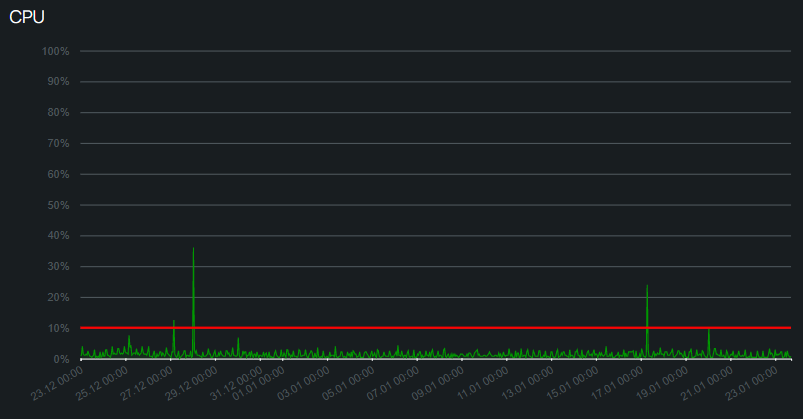

[//]: # ([![Typing SVG]&#40;https://readme-typing-svg.herokuapp.com?color=%2336BCF7&lines=Computer+science+student&#41;]&#40;https://git.io/typing-svg&#41;)

[//]: # ()
[//]: # ([![KnlnKS's LeetCode stats]&#40;https://leetcode-stats-six.vercel.app/api?username=Xpom7&theme=dark&#41;]&#40;https://leetcode.com/Xpom7/&#41;)

#Про бота

Ссылка на [бота](https://t.me/MAI_tabel_bot)

Публикации:
[One](https://vk.com/maevnik?w=wall-58942429_119383)
[Two](https://t.me/MAIuniversity/3262)
___
##Как все работает? 

Для начала нужно пройти авторизацию и указать свою группу

Тут можно ошибиться пока пишешь свою группу, поэтому бот может подсказать

.png)

Теперь вы можете смотреть расписание на любой удобный вам день

.png)

Так же вам доступна функция добавления домашнего задания (Как это делают учителя в школах)

Но для этого нужно пройти регестрацию

.png)

После регестрации у вас в информации отобразится ваш статус, для какой группы вы можете записывать дз

.png)

Теперь вы можете записывыть дз, для этого надо нажать на кнопку "Добав. Дз" 

Выбираете неделю на которую хотите записать дз

.png)

Далее день

.png)

Выбираете предмет и записываете дз

.png)

После всего этого вам нужно подтвердить вашу запись этого дз, тк его **смогут увидеть все ваши одногруппники**

.png)

Бууууум :boom:

Теперь оно отображается для всех)

.png)
___

##Статистика

Данная статистика актуальна на 23.01.2023

Общее количество пользователей: **1100+**

Уникальных запросов в день: **140+**

.png)

Нагрузка на сервер


___
## Асинхронность

Она была достигнута с помощью библиотеки [aiogram](https://docs.aiogram.dev/en/latest/)

Ознкомиться можно тут [Bot_aiogram](Bot_aiogram.py)
___
## Работа с DB

Была использована библиотека [**sqlite3**](https://docs.python.org/3/library/sqlite3.html)

Все основные методы реализации предоставлены в [Work_With_db](Work_With_db.py)
___
## Coroutine

Реализована с помощью [threading](https://docs.python.org/3/library/threading.html)
```python
def update():
    while True:
        time.sleep(21_600)
        check_file_update()

threading.Thread(target=update, daemon=True).start()
```
Этот код запускает скрипт, который каждые 6 часов обновляет данные о файлах

Нужно для хранения актуальных файлов
___

## Цензура
Была реалезованна проверка на маты
```python
def mat(slova):
    return set(j.lower().translate(str.maketrans('', '', string.punctuation)) for j in slova.split()).intersection(
        set(i.get('word') for i in json.load(open('need/cenz.json')))) != set()
```
___
## Интересные решения

С помощью этого кода была реализована задержка перед нажатиями кнопок, чтобы уменьшить нагрузку на сервер
```python
def rate_limit(limit: int):
    def decorator(func):
        setattr(func, "throttling_rate_limit", limit)
        return func
    return decorator
```

Сделан генератор клавиатуры
```python
def gen_lesson_dz(group, day) -> types.InlineKeyboardMarkup:
    markup = types.InlineKeyboardMarkup(row_width=2)
    lesson = lesson_day(group, day)
    if len(lesson) > 0:
        for i in range(len(lesson)):
            markup.insert(types.InlineKeyboardButton(f"{lesson[i][:25]}...",
                                                     callback_data=f"DZ_lesson_{lesson[i][:25]}"))
        markup.insert(types.InlineKeyboardButton(f"В начало", callback_data=f"DZ_add"))
    else:
        markup.insert(types.InlineKeyboardButton(f"В начало", callback_data=f"DZ_add"))
    return markup
```